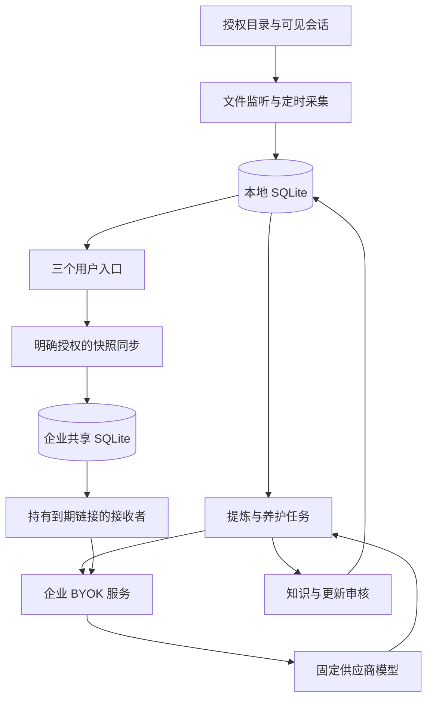

# WorkTwin 1.2.0 架构

员工本地进程负责授权采集、索引、知识编辑、审核与发布同步；企业进程持有模型供应商 Key、执行费用控制和保存允许分享的知识快照。UI 只有信息采集、我的知识库、我的数字分身。

## 浏览器任务采集（新增独立事件流）

浏览器采集不是持续文件扫描的另一种目录。业务平台签名的开始/完成票据由插件并行于原生跳转送到本地 WorkTwin；经过可信 issuer、公钥、时效、nonce 及扩展配对验证后创建 browser_capture_sessions。只有流程按钮对应的新导航、精确 HTTPS 路径、tabId 与 documentId 全部匹配，才能绑定 DOM 观察器；在任何顶层文档导航、SPA 路由变化或打开后继标签页时停止。完成票据关闭任务，页面监控结束不自动等于任务完成。

browser_capture_events 按递增 seq 保存脱敏事件，browser_capture_steps 保存归并的可观察操作，browser_capture_signals 防重放；browser_analysis 在用户额外授权时按多步骤向模型请求未验收的阶段总结。默认关闭且不直接生成知识，不进入文件扫描的 documents/ai_jobs SHA 更新链路。未来通过统一证据索引连接到知识审核流程，不跳过 scope、证据引用和分身授权。

## 本地状态与一致性

`sources` 分别记录采集、AI 和分享权限。`documents/chunks/chunks_fts` 存完整解析文本和搜索索引。内容 SHA 驱动增量队列；`ai_jobs` 的领取凭据及租约恢复防止旧结果回写或新数据库对象重置正在运行的任务。

`knowledge` 保存正文、分类、确认状态、版本和复核标志，`knowledge_evidence` 将引文绑定来源内容；来源变化使旧证据失效，部分撤销要求重新复核。模型提炼校验 JSON 和原文引文；这些校验不能独立证明语义正确。

`knowledge_proposals` 保存同项目补充/替换/冲突或养护建议。接受时再检查资料哈希与知识版本，在同一事务记录旧版、更新正文和证据。养护在新资料任务空闲后运行，每日最多 8 篇，同版本冷却 7 天；养护提案不会阻断原确认内容的分身查询。

Markdown 禁用原始 HTML；`[[K123|标题]]` 由稳定 ID 定位。`relations.py` 按可见知识和有效证据计算正反链接与共同来源，导出单篇 Markdown 和 INDEX；不引入额外图数据库。Rowboat 的字段/列表/标题解析被小范围移植用于标题和检索关键词，许可保留于 third_party。

`twins/twin_knowledge` 仅保存授权映射，分身不复制全部知识。问答按中文短语和标题/别名/关键词选取有限上下文，附 KID 引用，校验无依据/伪造引用输出，调用完成后再复核权限。

## 共享与服务端

`publications` 是本机 opt-in 状态，持久记录安装 ID、发布序号与成功快照摘要。同步串行发送完整允许快照；失败保留待同步提示，恢复后重试。只有已确认、有效、非个人偏好且全部贡献来源允许 AI/分享的授权知识进入发布。

服务端 `installations/assets/twins/assignments` 在事务中替换快照，以所有者/安装/知识 ID 去重，多分身引用同一资产。低于当前发布序号的快照被拒绝。`grants` 只存随机访问令牌的哈希、标签、到期时间和撤销状态。回答完成后复查授权和快照版本，防止运行中撤销后仍返回旧结果。

`ProviderService` 固定模型与供应商凭据，先事务预留调用额度，成功后记录供应商报告用量。SQLite 记录调用状态但不保留提示正文；日调用/Token 限额、每凭据分钟限流及单进程信号量控制成本和负载。发布审计也不记录正文。远程 HTTPS 由组织代理提供；本地管理 API 绑定 loopback，采用会话令牌与 Host 校验。

本地离线修改无法立即改变企业快照，待同步提示是明确的产品状态。共享链接是持有者访问凭据，不是 SSO 或组织原 ACL。完整部署条件和恢复限制见 [DEPLOY](DEPLOY.md)。
