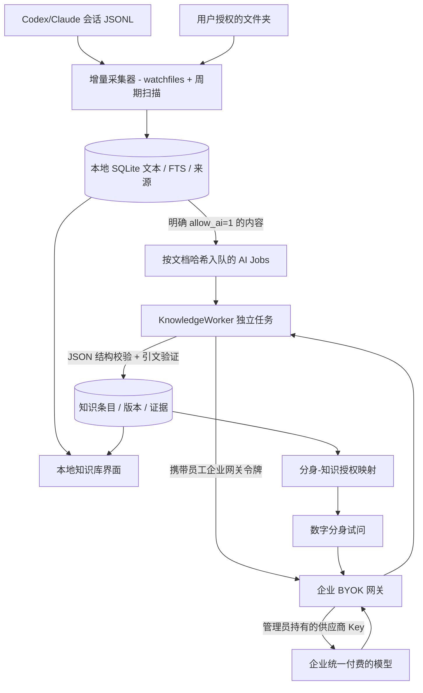

# WorkTwin Collector · v0.4 技术架构

## 产品目标与边界

构建一个本地优先的采集与知识组织客户端。员工只管理「信息采集」「我的知识库」「我的数字分身」；本地采集/增量处理/个人习惯提取作为后台能力，不设计额外的终端用户管理入口。

## 数据边界

1. **采集授权**：员工手动添加的目录是唯一的数据采集白名单；`enabled=0` 停止更新数据，原有知识不会自动消失。
2. **AI 整理授权**：`sources.allow_ai=0` 为默认。只有启用后新内容才会成为模型整理任务，并把相应文本经企业网关发送给模型提供商。
3. **分身授权**：`twin_knowledge(twin_id, knowledge_id)` 为唯一分身知识读取授权。赋权、撤权由本人本地工作台操作；不会为每个分身复制整个知识库。
4. **来源生命周期**：撤销采集目录将级联删除该目录的 `documents` / `chunks` / `ai_jobs` / `knowledge_evidence`；失去最后证据的 source-bound 知识删除，继而自动从分身授权关系中消失。
5. **有效性**：文档改动时将原引文标记旧版并验证在新文本中是否仍可找到；`needs_review=1` 的知识不能被分身读取。
6. **本机访问**：本地 FastAPI 只监听 127.0.0.1，管理 API 使用会话令牌，主机头白名单；它**不是**企业共享服务，也不应开放到公网。

## 采集工作流

- `Collector` 使用 `watchfiles` 监听文件变更；定时扫描兜底。每个文件记录大小、mtime、SHA256。元数据变化但内容未变时只更新元信息。
- 适配 `folder`、`codex`、`claude`。文本、DOCX、PDF 等经成熟第三方解析库得到文本；会话 JSONL 经角色过滤转为可见时间线。
- 资料内容存本地 SQLite `documents.content`，按块放入 `chunks`，由 FTS5 trigram 索引。**本地有明文文本副本**，原始 PDF/Word 二进制不复制到云端。
- 对允许 AI 整理的来源，`ai_jobs` 保存 `document_id`、`content_sha`、状态、重试次数。独立模型 Worker 处理成功后写知识；内容变化时哈希会让旧任务结果失效。

## 模型及知识处理

- `GatewayClient` 按 OpenAI Chat Completions 兼容协议发送消息；员工端仅配置企业地址和短期网关访问令牌，不保存模型供应商 Key。
- `worktwin.gateway` 在企业端固定供应商 URL、模型名称和付款凭据，拒绝普通用户覆盖模型路由。服务器当前只提供试点鉴权，生产时需独立完善 IAM、授权、审计、费用及安全治理。
- `extract_knowledge` 从资料中提取 `fact`、`decision`、`process`、`preference`，要求返回 JSON 和连续原文引文，至少 8 字。纯文档不生成个人偏好；AI 会话只抽取员工本人发言。原文检查不能独立保证总结正确性，知识仍可由员工手动校订。
- 版本历史存于 `knowledge_history`。人工编辑不改变引用证据的有效性；归档会使内容退出分身可用范围。
- 当前**未实现**跨多轮会话的自动主题融合与矛盾检测，后续将引入可回滚的合并提案和冲突处理。旧版的规则候选函数保留仅为历史回归兼容，不由采集任务调用。

## 关键表

| 表 | 用途 |
|---|---|
| `sources` | 本地授权目录，采集状态，AI 处理授权，适配器 |
| `documents`, `chunks`, `chunks_fts` | 完整解析文本、增量索引、全文检索 |
| `ai_jobs` | 持久任务队列，按内容哈希防止错误回写 |
| `knowledge` | 知识正文、分类、状态、创建者、修订版 |
| `knowledge_evidence` | 来源文档、引文、有效性和会话时间 |
| `knowledge_history` | 人工编辑前的完整快照 |
| `twins`, `twin_knowledge` | 多分身及知识勾选授权，不复制文档 |
| `events` | 本地采集与修改事件 |

## 技术选型

- **Python 3.11+ / FastAPI**：采集处理任务、模型网关原型、本地管理服务。
- **SQLite / FTS5**：单员工本地存储，低成本，重启后持久化；不引入单独数据库服务。
- **watchfiles**：跨平台增量文件事件，配合定时全量校验。
- **pypdf / python-docx**：成熟的文本提取能力。
- **原生浏览器 UI**：无第三方 CDN，轻量化工作台；通过 `desktop` 脚本可在 Mac/Windows 构建未签名应用封装，但目前交付物不是原生签名安装包。

## 数据治理待解决

必须在企业级产品化前解决：SAML/OIDC/SSO 与真正分身分享、企业资料所有权限制、数据分类和 DLP、资料删除后的备份保留、服务端日志/缓存的隐私策略、模型 token 计量与预算、跨文档知识版本与冲突、动态权限的并发一致性、分身问答可验证引用、生产知识质量测试。

## v0.5 知识更新提案

- `knowledge_proposals`: `document_id`, `content_sha`, `target_id`, `target_version`, `action(enrich|replace|conflict)`, `title`, `body`, `quote`, `reason`, `status`。
- `knowledge.review_hold`：来源部分撤销后的粘性人工复核状态；`knowledge.needs_review` 由该标记、旧版失效证据以及未解决提案共同决定。
- `knowledge_evidence.superseded`：保留旧引用供查证，但更新后的分身只使用未被取代且依然有效的证据。
- `ai_jobs.next_run_at`：失败重试时间，最多四次尝试，限次指数退避。
- 合并时先由企业模型基于**同项目且全部已获 AI 处理授权的现有知识**给出结构化提案；不满足条件则创建独立新知识条目，绝不让 AI 自动覆盖。
- 接受更新时原文 `sha256` 与目标 `version` 必须同时仍然有效；同一事务完成历史记录、新证据和正文更新。

以上机制只保证可核对和可回滚，不代表模型生成的事实一定正确，必须用真实数据继续评测。
